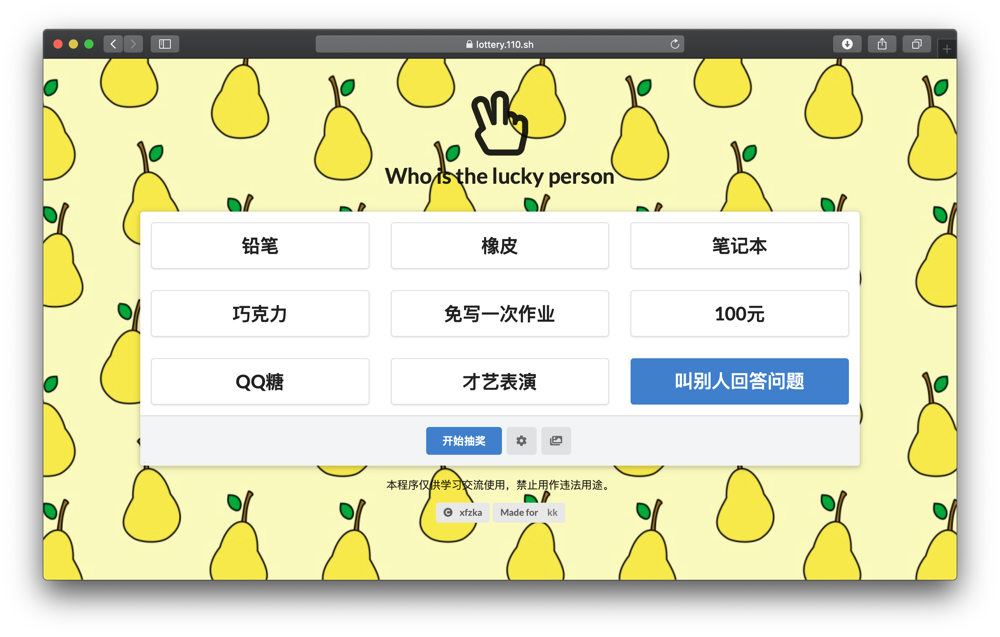

# 简易抽奖程序

可控制中奖率的简易抽奖程序，手动启停，可更换背景，自定义标题等。

DEMO：[https://lottery.110.sh](https://lottery.110.sh)




## 使用说明

### 部署

1. 下载或克隆本项目
2. 在源码根目录输入代码`python3 -m http.server`
3. 访问 http://IP:8000

### 使用

根据提示使用即可。

您也可以填写下面的内容到奖池设置中：

```text
铅笔 2
橡皮 1
笔记本 2
巧克力 2
免写一次作业 5
100元 0
QQ糖 1
才艺表演 3
叫别人回答问题 4
```

## 目录介绍

```text
.             存放压缩过的代码
readme.md     本文件
-- background 存放背景图片
-- resource   存放 semantic-ui 代码，当无法访问外网或不喜欢CDN时可以使用
-- source     存放未经压缩过的代码
```

## 附

1. 压缩工具 https://github.com/tdewolff/minify/tree/master/cmd/minify

   压缩指令 `cd source && minify ./* -o ../ -v`

   开发时    `cd source && minify ./* -o ../ -v -w `
